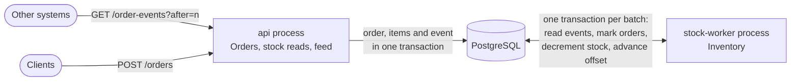

# Solution

This is the design narrative: what the system is, the decisions that carry it, and what they cost.
It points into [specs/](specs/README.md) for detail rather than repeating it.
Implementation notes are added in the final section as the code lands.

## What it is

A small order-intake and stock service in Python and PostgreSQL.
It accepts orders over HTTP, prices them from a catalogue, stores them, decrements stock asynchronously, and publishes a feed of accepted orders that other systems can consume.
It is built to handle two everyday failures correctly: clients submitting the same order more than once, and the stock-processing component being down for a while.

## Shape

Three components, Catalogue, Orders and Inventory, own disjoint tables in one database and run in two processes that share nothing but committed rows.
Dependencies point one way, from Inventory to Orders to Catalogue, and are enforced by import-linter.
Details: [03-architecture.md](specs/03-architecture.md), [ADR-0001](specs/adr/0001-components-and-processes.md).

## The five decisions that carry the design

### 1. `order_ref` is the order's identity, so duplicates collapse in the database

`order_ref` is the primary key.
Acceptance inserts with `INSERT ... ON CONFLICT (order_ref) DO NOTHING` under `READ COMMITTED`.
When two submissions race, the second waits on the unique index, finds the winner's committed row, and compares content: identical gives `200` with the existing order, different gives `409`.
A client can therefore retry after any failure, and exactly one order counts, whatever the timing.
There is no idempotency table and no expiry, because the key is the order itself.
Details: [05-reliability.md](specs/05-reliability.md#duplicate-submissions), [ADR-0005](specs/adr/0005-order-ref-idempotency.md).

### 2. The order and its event commit together

Accepting an order appends an `order.accepted` event to `order_events` in the same transaction: a transactional outbox.
Nothing calls another component or a broker after the commit, so a crash can neither lose downstream work nor create work for an order that does not exist.
Both the stock applier and the public feed consume this one log.
Details: [ADR-0003](specs/adr/0003-transactional-outbox.md), with PostgreSQL chosen over a broker in [ADR-0002](specs/adr/0002-postgresql-as-message-substrate.md).

### 3. The log is commit-ordered

Sequence values are drawn at insert time but committed in any order, so a consumer that stores "last seen ID" can skip an event that commits late.
Each acceptance therefore takes a transaction-scoped advisory lock just before appending its event; PostgreSQL releases it only after the commit is visible, so event ID order equals commit order and a cursor never skips.
The cost is that appends are serialized, capping intake near the WAL flush rate, which is orders of magnitude above this system's needs.
Details: [05-reliability.md](specs/05-reliability.md#commit-ordered-event-log), [ADR-0004](specs/adr/0004-commit-ordered-event-log.md).

### 4. Stock follows the log, exactly once, and may go negative

The stock applier runs one transaction per batch: lock its offset row, read the next events, move their orders from `accepted` to `stock_committed` with a guarded update, decrement stock per SKU, advance the offset.
Reading is at-least-once, but the effect is exactly-once, because the effect and the progress commit together and the guarded status transition ignores any order already applied.
An outage of the applier is just unread rows: intake and the feed carry on, stock reads report how far they lag through `as_of_event_id`, and on restart the normal loop drains the backlog.
Stock is decremented even below zero; a negative value is a backorder.
That keeps an acknowledged order valid and makes the result after an outage identical to the result without one, because decrements commute.
Details: [05-reliability.md](specs/05-reliability.md#stock-application), [ADR-0006](specs/adr/0006-asynchronous-stock-decrement.md).

### 5. Other systems pull a feed

`GET /order-events?after=<event_id>` serves the log in commit order, with a full order snapshot per event.
Consumers keep their own cursor, so the server holds no per-consumer state, a consumer outage costs only lag, and replay is free.
Delivery is at-least-once; consumers deduplicate by `event_id`.
`consume-feed` is the reference consumer, and the stock applier reads the same log through the same function.
Details: [04-api.md](specs/04-api.md#get-order-events), [ADR-0007](specs/adr/0007-integration-surface-pull-feed.md).

## What a caller can rely on

| Guarantee | Proven by |
| --- | --- |
| One order per `order_ref`, even under concurrent submission | AC-DUP-04, AC-DUP-08 |
| Retrying `POST /orders` is always safe and never reprices | AC-DUP-01, AC-DUP-06 |
| Orders are accepted while the stock worker is down | AC-ORD-08, AC-OUT-01 |
| Stock catches up to exactly the no-outage value | AC-OUT-02, AC-OUT-03 |
| A killed stock worker leaves no partial effect and applies nothing twice | AC-OUT-04, AC-OUT-05 |
| The feed never skips an event and never changes one | AC-FEED-04, AC-FEED-05 |
| Every response matches the committed OpenAPI contract | AC-API-01 |

## Trade-offs accepted

- **One shared database for three components.**
  It makes exactly-once stock application a local transaction; the price is schema coordination and an in-transaction call from Inventory into Orders.
  The path to separate services is written down in [03-architecture.md](specs/03-architecture.md#evolution-paths).
- **Serialized event appends.**
  A simple, provable ordering guarantee instead of a snapshot-horizon scheme that scales further but is much harder to reason about.
- **Polling.**
  Half a second of stock latency and one cheap query per interval, instead of push machinery.
- **Possible overselling.**
  Negative stock is visible and exact; rejecting orders after acknowledging them would be worse.
- **No ORM.**
  Every statement the correctness argument relies on is visible in the code; the cost is hand-written SQL for about fifteen statements.
- **Eventually consistent stock reads.**
  Staleness is explicit through `as_of_event_id` rather than hidden.

## Deliberately not built

Authentication, order cancellation or amendment, reporting, catalogue and stock administration, reservations and fulfilment, multi-currency, push delivery, log retention, parallel stock application, database failover, and metrics.
Each is a named non-goal with its reason in [01-requirements.md](specs/01-requirements.md#non-goals).

## How it is verified

Every requirement has an ID, every acceptance scenario traces to requirements, and every test is named after its scenario ([06-acceptance.md](specs/06-acceptance.md)).
Tests run against a real PostgreSQL, including a race of twenty concurrent duplicates and a stock-worker process killed with `SIGKILL` in the middle of a transaction.
Every HTTP response in the suite is validated against [openapi.yaml](specs/openapi.yaml), and the service publishes that same document as its contract.
The recorded demonstration follows the script in [07-demo.md](specs/07-demo.md).

## Implementation notes

This section records the as-built state: deviations from the specification with their reasons, and observations from running the system.
