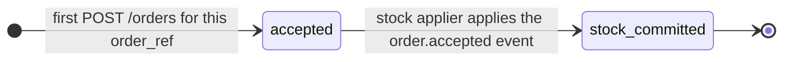
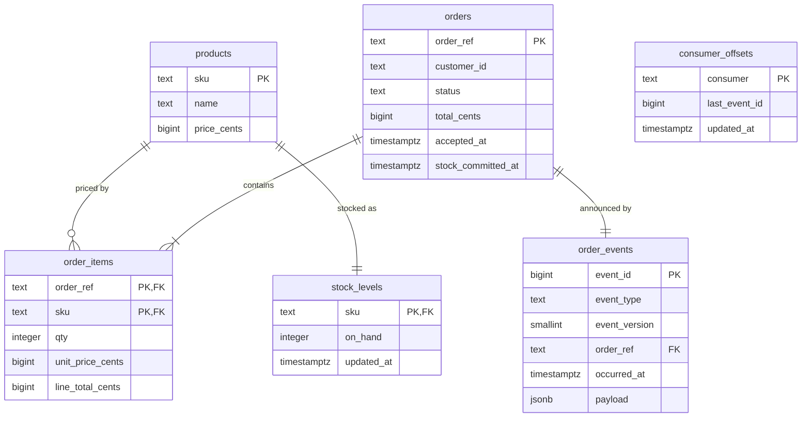

# 02 - Domain model

This document defines the vocabulary, the entities and their invariants, the order lifecycle, and the PostgreSQL schema.
The DDL in [Schema](#schema) is normative: migration `0001_initial.sql` must match it statement for statement.

## Vocabulary

| Term | Meaning |
| --- | --- |
| Product | A sellable item in the catalogue, identified by its `sku`, with a name and a price. |
| Order | A customer's request for products, identified by its client-supplied `order_ref`. |
| `order_ref` | The order's identity. It is chosen by the client and doubles as the idempotency key. |
| Accepted order | An order that the system has persisted. Only accepted orders count, and each `order_ref` has at most one. |
| Duplicate submission | A create request whose `order_ref` already belongs to an order. |
| Order event | An immutable record appended to the event log. The only type is `order.accepted`. |
| Event log | The `order_events` table, ordered by `event_id`. It is both the outbox for internal work and the source of the public feed. |
| Stock applier | The Inventory process that reads the event log and applies stock decrements. |
| Offset | The highest `event_id` a consumer has fully processed. The stock applier keeps its offset in `consumer_offsets`. |
| `on_hand` | Units of a SKU that the business holds, after every applied order. It may be negative. |
| Backorder | Negative `on_hand`: units sold that are not physically available. |
| Lag | The number of events between the head of the event log and the stock applier's offset. |
| Catch-up | The stock applier processing the events that accumulated while it was not running. |

## Conventions

### Money

All amounts are integer minor units of the store's single currency, in fields and columns whose names end in `_cents`.
Columns are `bigint`; JSON carries them as integers.
Floating-point numbers never represent money, in the database, in Python, or on the wire.
The only arithmetic is multiplication of a quantity by a unit price and summation, so no amount is ever rounded.
Multi-currency is a non-goal (NG-06); when it is needed, a `currency` column on `orders` is the first step.

### Identifiers

`order_ref`, `customer_id` and `sku` are opaque, case-sensitive strings of 1 to 64 characters.
The API accepts them in request bodies only if they match `^[A-Za-z0-9][A-Za-z0-9._-]{0,63}$`, so every identifier it stores is safe in a URL path without encoding.
Path parameters are not validated: a value that matches no order or SKU yields `404`.
The database enforces the length bound; the character rule is an input-format rule and lives at the API boundary.

### Time

Timestamps are `timestamptz`, and all connections use `TimeZone=UTC`.
The API renders them as RFC 3339 strings in UTC with a `Z` suffix.
Timestamps are informational: ordering is always by `event_id`, never by time.

## Entities and invariants

Invariant IDs are referenced by the constraint table and by the acceptance scenarios.

### Product (Catalogue)

| Attribute | Type | Notes |
| --- | --- | --- |
| `sku` | text | Identity. |
| `name` | text | 1 to 200 characters. |
| `price_cents` | bigint | Current price, zero or more. |

- **INV-CAT-1**: A `sku` identifies at most one product.
- **INV-CAT-2**: `price_cents >= 0`.

### Order (Orders)

| Attribute | Type | Notes |
| --- | --- | --- |
| `order_ref` | text | Identity and idempotency key. |
| `customer_id` | text | Opaque reference to a customer owned by another system. |
| `status` | text | `accepted` or `stock_committed`. |
| `items` | list of OrderItem | One or more, at most one per SKU. |
| `total_cents` | bigint | Sum of the items' line totals. |
| `accepted_at` | timestamptz | When the accepting transaction started. |
| `stock_committed_at` | timestamptz or null | When the stock applier applied the order's stock; never earlier than `accepted_at`. |

An OrderItem has `sku`, `qty`, `unit_price_cents` and `line_total_cents`.

- **INV-ORD-1**: An `order_ref` identifies at most one order.
- **INV-ORD-2**: An order has at least one item, and at most one item per SKU.
- **INV-ORD-3**: `qty > 0` for every item.
- **INV-ORD-4**: `line_total_cents = qty * unit_price_cents` for every item.
- **INV-ORD-5**: `total_cents` equals the sum of the order's `line_total_cents`.
- **INV-ORD-6**: `customer_id`, `items`, unit prices and `total_cents` never change after acceptance.
- **INV-ORD-7**: `stock_committed_at` is set if and only if `status = 'stock_committed'`.
- **INV-ORD-8**: The only status change is `accepted` to `stock_committed`, and it happens at most once.

### Order event (Orders)

| Attribute | Type | Notes |
| --- | --- | --- |
| `event_id` | bigint | Position in the log. Strictly increasing in commit order; gaps are possible. |
| `event_type` | text | `order.accepted`. |
| `event_version` | smallint | Version of the payload schema for this type, currently `1`. |
| `order_ref` | text | The order the event is about. |
| `occurred_at` | timestamptz | Equal to the order's `accepted_at`. |
| `payload` | jsonb | Snapshot of the order at acceptance, as defined by `OrderAcceptedData` in [openapi.yaml](openapi.yaml). |

- **INV-EVT-1**: Every accepted order has exactly one `order.accepted` event, and it is created in the same transaction as the order.
- **INV-EVT-2**: Events are never updated or deleted.
- **INV-EVT-3**: If event `N` is visible to a reader, every event with an ID lower than `N` that will ever exist is already visible to that reader.

Gaps in `event_id` appear when an accepting transaction rolls back after drawing an ID.
Consumers must not assume contiguity; INV-EVT-3 is the property they rely on.

### Stock level (Inventory)

| Attribute | Type | Notes |
| --- | --- | --- |
| `sku` | text | The product this level belongs to. |
| `on_hand` | integer | Units held. May be negative (backorder). |
| `updated_at` | timestamptz | Last change. |

- **INV-STK-1**: Every product has exactly one stock level; `seed` creates both in one transaction.
- **INV-STK-2** (conservation): `on_hand = initial_on_hand - sum(qty)` over the items of all `stock_committed` orders for that SKU.
- **INV-STK-3**: `on_hand` has no lower bound (see [ADR-0006](adr/0006-asynchronous-stock-decrement.md)).

### Consumer offset (Inventory)

| Attribute | Type | Notes |
| --- | --- | --- |
| `consumer` | text | Consumer name. The only row is `stock-applier`. |
| `last_event_id` | bigint | Highest `event_id` fully applied. |
| `updated_at` | timestamptz | Last change. |

- **INV-OFF-1**: An order is `stock_committed` if and only if its event's `event_id <= last_event_id` of `stock-applier`.
- **INV-OFF-2**: `last_event_id` only increases.

INV-STK-2 and INV-OFF-1 together are what makes `as_of_event_id` meaningful: `on_hand` reflects exactly the orders whose events are at or below the offset.

## Order lifecycle



| From | To | Trigger | Performed by | Guard | Effects in the same transaction |
| --- | --- | --- | --- | --- | --- |
| none | `accepted` | `POST /orders` with an unused `order_ref` | `api` process, Orders component | Request valid, all SKUs in the catalogue, `order_ref` unused | Insert order and items, append `order.accepted` |
| `accepted` | `stock_committed` | The stock applier reads the order's event | `stock-worker` process, Inventory calling Orders' `mark_stock_committed` | `status = 'accepted'` | Set `stock_committed_at`, decrement `on_hand` per item, advance the offset |

`stock_committed` is terminal.
Every other transition is illegal, including any transition out of `stock_committed` and any return to `accepted`.
A duplicate submission is not a transition: it reads the order and changes nothing.
An order stays `accepted` for exactly as long as the stock applier lags behind its event; there is no timeout, because an outage of the applier is an expected condition (REQ-OUT-01), not a failure of the order.

## Schema

### Table ownership

Each table has exactly one owning component, which is the only component that issues SQL against it.
Other components use the owner's Python interface, defined in [03-architecture.md](03-architecture.md#component-interfaces).

| Table | Owner |
| --- | --- |
| `products` | Catalogue |
| `orders`, `order_items`, `order_events` | Orders |
| `stock_levels`, `consumer_offsets` | Inventory |

Foreign keys point within a component or toward `products`.
The catalogue is insert-only reference data that every component shares, so a foreign key to it never blocks another component's change.
No foreign key points into an Orders or Inventory table from another component, which keeps each of those free to move to its own database.

### Entity-relationship diagram



### DDL

```sql
-- Catalogue ------------------------------------------------------------------

CREATE TABLE products (
    sku          text   PRIMARY KEY,
    name         text   NOT NULL,
    price_cents  bigint NOT NULL,
    CONSTRAINT products_sku_length         CHECK (char_length(sku) BETWEEN 1 AND 64),
    CONSTRAINT products_name_length        CHECK (char_length(name) BETWEEN 1 AND 200),
    CONSTRAINT products_price_non_negative CHECK (price_cents >= 0)
);

-- Orders ---------------------------------------------------------------------

CREATE TABLE orders (
    order_ref           text        PRIMARY KEY,
    customer_id         text        NOT NULL,
    status              text        NOT NULL DEFAULT 'accepted',
    total_cents         bigint      NOT NULL,
    accepted_at         timestamptz NOT NULL DEFAULT now(),
    stock_committed_at  timestamptz,
    CONSTRAINT orders_order_ref_length   CHECK (char_length(order_ref) BETWEEN 1 AND 64),
    CONSTRAINT orders_customer_id_length CHECK (char_length(customer_id) BETWEEN 1 AND 64),
    CONSTRAINT orders_status_known       CHECK (status IN ('accepted', 'stock_committed')),
    CONSTRAINT orders_total_non_negative CHECK (total_cents >= 0),
    CONSTRAINT orders_stock_committed_at_matches_status
        CHECK ((status = 'stock_committed') = (stock_committed_at IS NOT NULL))
);

CREATE TABLE order_items (
    order_ref         text    NOT NULL REFERENCES orders (order_ref),
    sku               text    NOT NULL REFERENCES products (sku),
    qty               integer NOT NULL,
    unit_price_cents  bigint  NOT NULL,
    line_total_cents  bigint  NOT NULL GENERATED ALWAYS AS (qty * unit_price_cents) STORED,
    PRIMARY KEY (order_ref, sku),
    CONSTRAINT order_items_qty_positive            CHECK (qty > 0),
    CONSTRAINT order_items_unit_price_non_negative CHECK (unit_price_cents >= 0)
);

CREATE TABLE order_events (
    event_id       bigint      GENERATED ALWAYS AS IDENTITY PRIMARY KEY,
    event_type     text        NOT NULL,
    event_version  smallint    NOT NULL,
    order_ref      text        NOT NULL REFERENCES orders (order_ref),
    occurred_at    timestamptz NOT NULL,
    payload        jsonb       NOT NULL,
    CONSTRAINT order_events_type_known       CHECK (event_type IN ('order.accepted')),
    CONSTRAINT order_events_version_positive CHECK (event_version >= 1),
    CONSTRAINT order_events_one_per_order_and_type UNIQUE (order_ref, event_type)
);

CREATE FUNCTION order_events_reject_mutation() RETURNS trigger
LANGUAGE plpgsql AS $$
BEGIN
    RAISE EXCEPTION 'order_events is append-only: % is not allowed', TG_OP;
END;
$$;

CREATE TRIGGER order_events_append_only
    BEFORE UPDATE OR DELETE ON order_events
    FOR EACH ROW EXECUTE FUNCTION order_events_reject_mutation();

-- Inventory ------------------------------------------------------------------

CREATE TABLE stock_levels (
    sku         text        PRIMARY KEY REFERENCES products (sku),
    on_hand     integer     NOT NULL,
    updated_at  timestamptz NOT NULL DEFAULT now()
);

CREATE TABLE consumer_offsets (
    consumer       text        PRIMARY KEY,
    last_event_id  bigint      NOT NULL DEFAULT 0,
    updated_at     timestamptz NOT NULL DEFAULT now(),
    CONSTRAINT consumer_offsets_last_event_id_non_negative CHECK (last_event_id >= 0)
);

INSERT INTO consumer_offsets (consumer) VALUES ('stock-applier');
```

The DDL requires PostgreSQL 12 or newer, because stored generated columns are the newest feature it uses.
The project supports and verifies PostgreSQL 14 or newer ([ADR-0008](adr/0008-technology-stack.md)).
Migrations are forward-only; there are no rollback scripts, because a correction is a new migration.

### Constraints and the invariants they enforce

The database enforces an invariant when a violation would corrupt the meaning of stored data, when the invariant must hold across concurrent transactions or processes, or when any writer other than the API (the `seed` command, an operator with `psql`) could break it.
Input-format rules stay at the API boundary.

| Constraint | Enforces | Why in the database |
| --- | --- | --- |
| `orders` primary key on `order_ref` | INV-ORD-1 | Uniqueness under concurrency can only be decided atomically by a unique index; an application check is a check-then-act race between transactions and processes. It is also the conflict target for `INSERT ... ON CONFLICT DO NOTHING` ([05-reliability.md](05-reliability.md#duplicate-submissions)). |
| `order_items` primary key on `(order_ref, sku)` | INV-ORD-2 (one item per SKU) | A repeated SKU would be double-counted in the total and in stock. The API reports it as a validation error; the key makes it impossible for every writer. |
| `order_items_qty_positive` | INV-ORD-3 | A zero or negative quantity would increase stock when applied. |
| `line_total_cents` generated column | INV-ORD-4 | The derivation is stored once and cannot drift from its inputs. |
| `orders_stock_committed_at_matches_status` | INV-ORD-7 | Ties the timestamp to the state in every row, so no writer can record half a transition. |
| `orders_status_known` | INV-ORD-8 (closed set of states) | Rejects any state the lifecycle does not define. |
| `products_price_non_negative`, `order_items_unit_price_non_negative`, `orders_total_non_negative` | INV-CAT-2 and the sign of derived amounts | Cheap guards against a seed or manual write producing negative money. |
| `order_events_one_per_order_and_type` | INV-EVT-1 (at most one event) | A backstop for a code defect that would append twice; consumers would otherwise see the order twice. |
| `order_events_append_only` trigger | INV-EVT-2 | External consumers replay the log and cache what they read, so a mutation from any code path or operator is a contract breach. The row-level trigger rejects every `UPDATE` and `DELETE`, whoever issues it. It does not intercept `TRUNCATE`, which fires no row-level trigger; no command of the system truncates the log, and only the test suite does, between tests on its own database. |
| `order_events` identity plus the append lock | INV-EVT-3 | Commit order is a property of concurrent transactions, which only the database can serialize; see [05-reliability.md](05-reliability.md#commit-ordered-event-log). |
| Foreign keys from `order_items` and `order_events` to `orders` | Referential integrity within Orders | Items and events never outlive or precede their order. |
| Foreign keys from `order_items` and `stock_levels` to `products` | Items and stock refer to real products | The catalogue is shared reference data (see [Table ownership](#table-ownership)). |
| `consumer_offsets_last_event_id_non_negative` | Offset domain | Event IDs start at 1, so 0 means "nothing applied". |
| Length checks on `sku`, `name`, `order_ref`, `customer_id` | Storage bounds | Keep data written outside the API within the bounds the API promises. |

Invariants deliberately enforced in application code:

| Invariant | Where | Why not in the database |
| --- | --- | --- |
| INV-ORD-2 (at least one item) | Request schema (`minItems: 1`) | A cross-row existence rule needs a deferred constraint trigger; the only writer inserts the order and its items in one function and one transaction. |
| INV-ORD-5 (total equals sum of lines) | `accept_order` computes both from the same values | Same reason; AC-ORD-01 and AC-STK-05 check it. |
| INV-ORD-6 (immutable after acceptance) | Orders exposes no update path except the status transition | The single update statement names only `status` and `stock_committed_at`. |
| INV-ORD-8 (only `accepted` to `stock_committed`, once) | The guard `WHERE status = 'accepted'` in `mark_stock_committed` | The transition is one statement in one function; the guard is atomic with the update. |
| INV-STK-1 (one stock level per product) | `seed` inserts both in one transaction | Enforcing it both ways needs circular deferred foreign keys. If it is ever violated, the stock applier stops rather than guess ([05-reliability.md](05-reliability.md#poison-events)). |
| INV-OFF-1 and INV-OFF-2 | The stock applier's single transaction | They relate rows in three tables changed together in one transaction by one writer. |

`stock_levels.on_hand` deliberately has no `CHECK (on_hand >= 0)`: negative stock is a legal, meaningful state (INV-STK-3).

### Indexes and query paths

Every query the system runs is served by a primary key or unique index; no secondary index is needed.

| Query | Index used |
| --- | --- |
| Look up an order by `order_ref`; detect a duplicate on insert | `orders_pkey` |
| Load an order's items | `order_items_pkey` (prefix `order_ref`) |
| Price lookup `WHERE sku = ANY(...)` | `products_pkey` |
| Feed page and stock applier batch: `WHERE event_id > $after ORDER BY event_id LIMIT $n` | `order_events_pkey` (range scan) |
| Head of the log: `max(event_id)` | `order_events_pkey` (backward scan) |
| Stock read and decrement by `sku` | `stock_levels_pkey` |
| Offset read and update | `consumer_offsets_pkey` |

Deliberately absent: an index on `order_items (sku)`, which a foreign key only needs when referenced products are deleted or re-keyed, and neither happens; and an index on `orders (status)`, because the stock applier is driven by the event log, not by querying for accepted orders.
